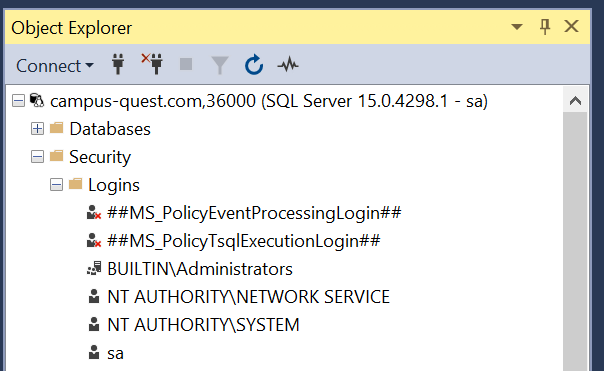
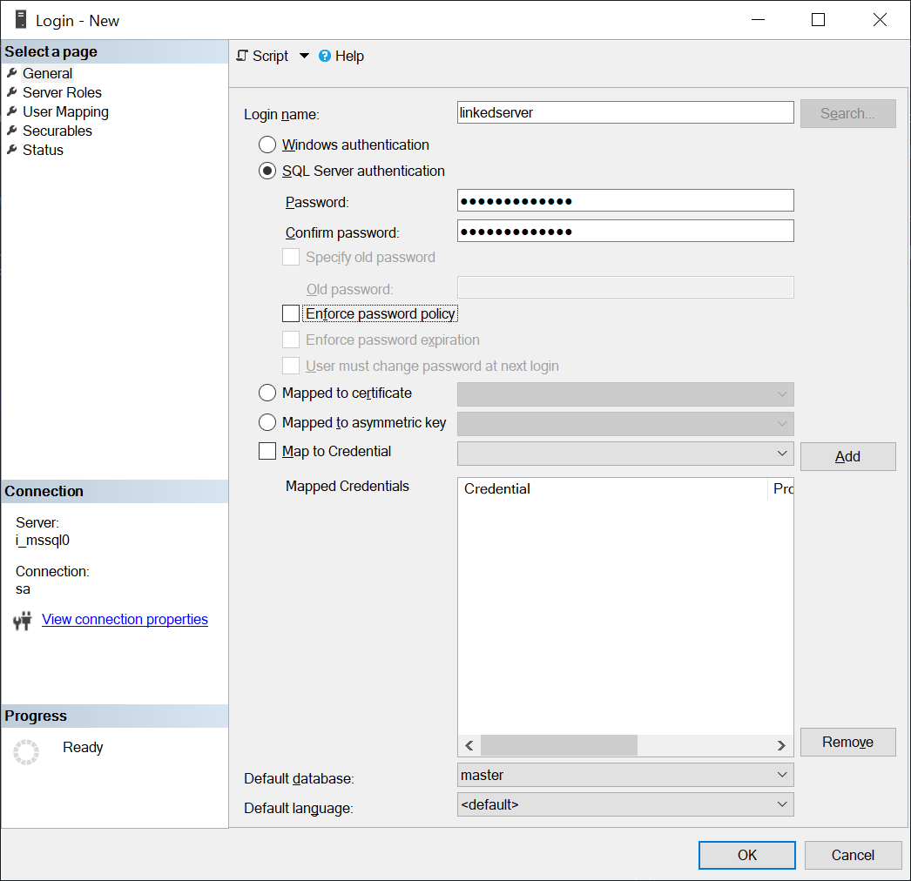
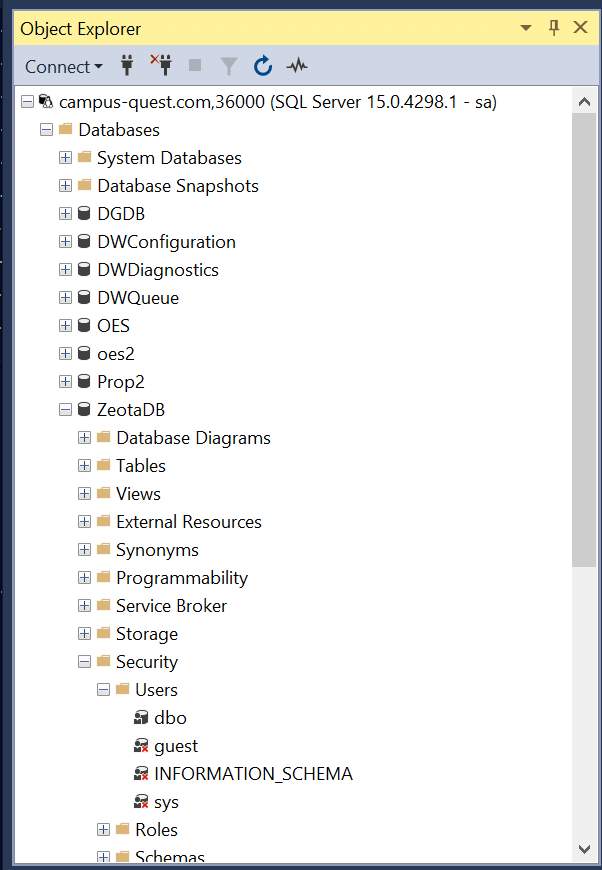
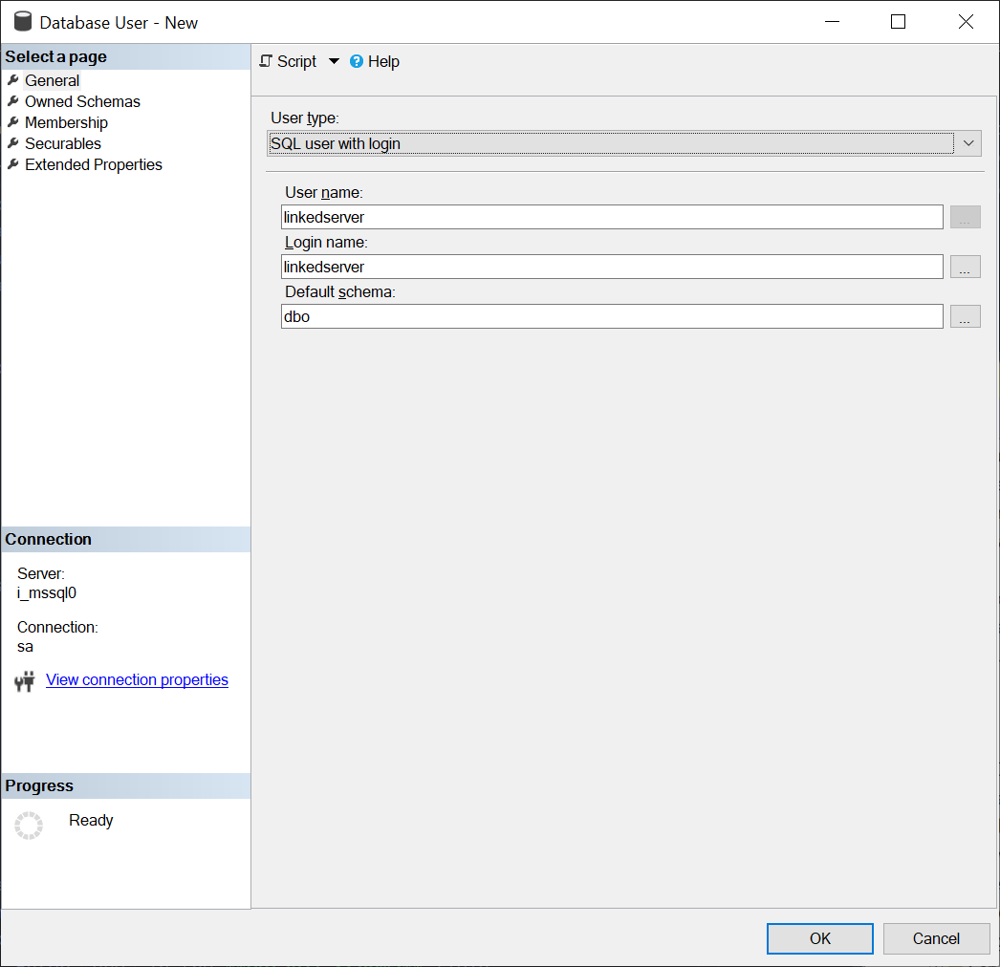
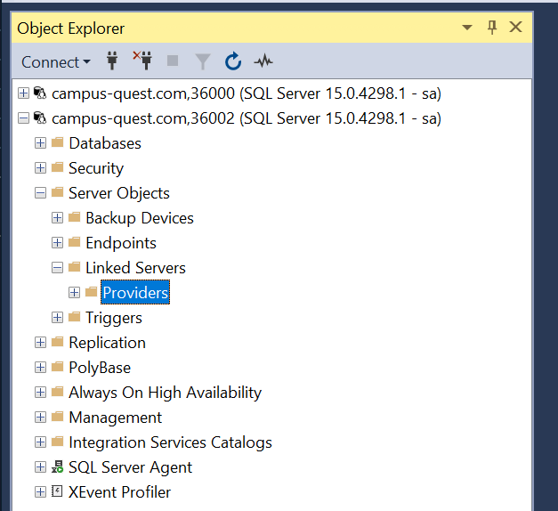
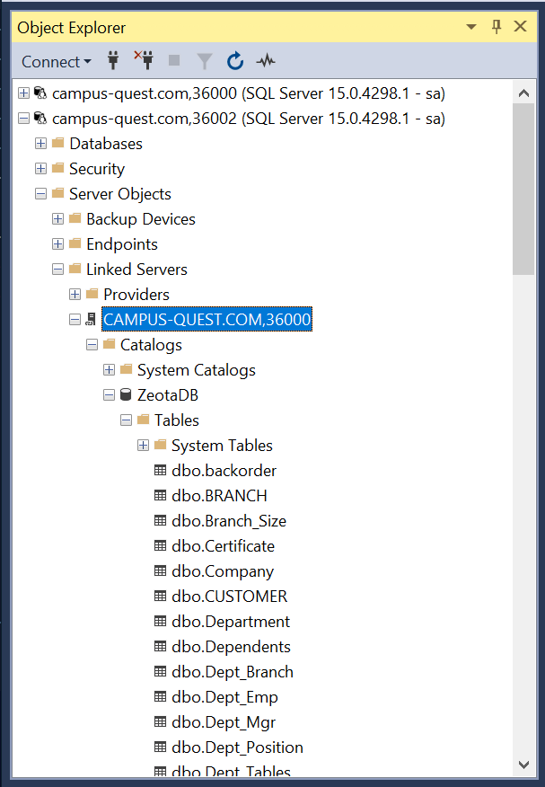
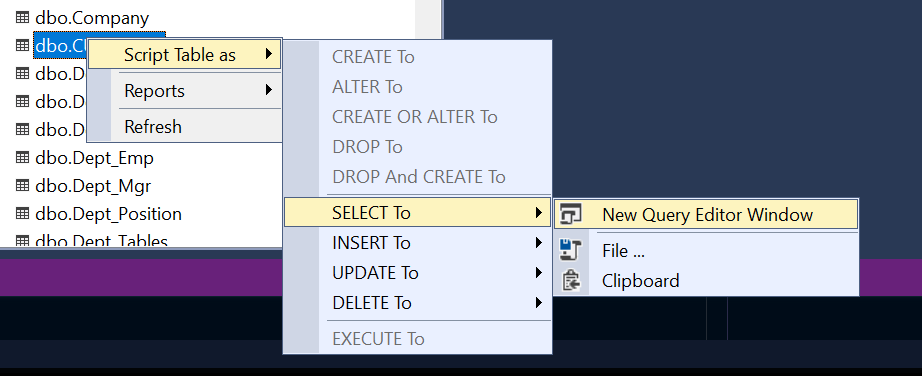
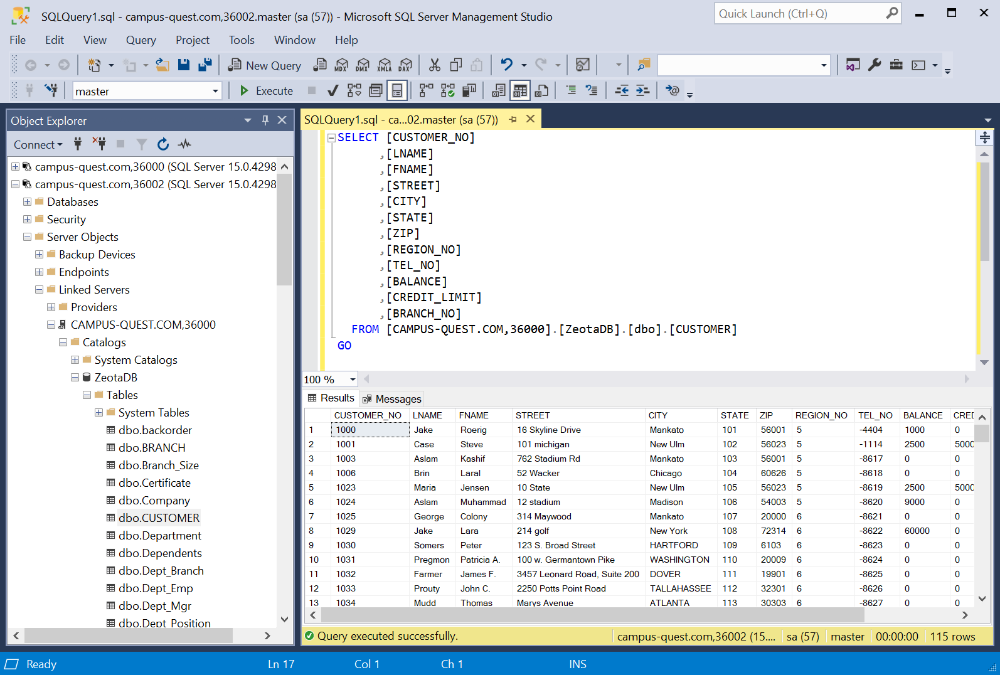

# Using Polybase to access Oracle Database from SQL Server

A [linked server](https://learn.microsoft.com/en-us/sql/relational-databases/linked-servers/linked-servers-database-engine) allows you to treat the resources on another SQL Server as if they are on your own local server. When linking two Microsoft SQL Servers together, you can perform queries across the server's databases and tables, update data on the remote server, execute stored procedures and create views that use data on the remote server, and so on. Essentially, the remote server appears as a new namespace on your server that you can directly interact with.

You can use [SQL Server Management Studio](https://learn.microsoft.com/en-us/sql/ssms/download-sql-server-management-studio-ssms) to create your linked server. These instructions will walk you through the process.

> **Note:** SSMS is not available for Mac. If you use a Mac, Azure Data Studio can do some of these tasks but the steps will differ and some of the steps may be more challenging.

*Note on terminology:* For the purposes of this discussion, the **server** is the server you are linking *to*, and the **client** is the server on which you are creating the linked server. For example, if you are on `sql0` and you want to access resources on `sql1`, `sql0` is the **client** and `sql1` is the **server**.

## Creating a linked server user

While not strictly necessary, it is **strongly recommended** that you create a user account on the destination linked server. This is good practice for production-level and industry database work. (In fact, you will almost *never* see the `sa` account used in professional settings; at the very least, the DBA will have a user account with the `sysadmin` role assigned. `sa` is only used to perform initial setup of the server after initial installation.)

Creating a user is a two-step process. First, you create a **login** on the server. This is the username and password that a user (or in this case, your client) will use to connect to the server. 

### Creating a login

1. To create a login, first navigate to Security -> Logins.

    

    Right-click on the **Logins** option and choose New Login.

2. Provide a login name. For example, you might use `linkedserver` or `serveraccess`. The username is up to you.
3. Enter a password for the linked server user in both of the Password fields. 
4. Uncheck the "Enforce password policy" check box. (The linked server user won't be able to change its password after all!)

    After you have filled out this screen, it should look roughly like this:

    

5. You can now click OK to create the new login.

    > **Note**: The **Server Roles** page is where you would go if you wanted to give your user equivalent access to the `sa` account.

Now that you have created a login, you must create a user within the database you want to give the user access to. 

### Creating a database user

A database user is an object in a database that links a server login to a user in the database and controls the privileges of that login when accessing the database. Each individual database needs a user that maps to the login of an account you want to be able to access that database (with the exception of certain account classes such as `sysadmin` or `bulkadmin` used for database backups.)

1. Open the database you wish to give the account access to.
2. Open Security -> Users.

    

3. Right click **Users** and choose **New User**.
4. In the **User name** field, provide a name for the user within the database. 

    > The username within the database does not need to be the same as the login name, however the username is not significant for the user themselves. It is, however, relevant if you are writing scripts to provide explicit granular permissions to the user. If you are unsure, you can use the same name as the login.

5. Enter the login name you created in the previous section in the **Login name** section. This is the login that will be given access to the database via this user object.
6. Enter `dbo` in the **Default schema** field.

    

7. Switch to the **Membership** page on the left of the window.
8. Assign privileges to the user account:
    * `db_owner` to give the user full access to the entire database - the user can do anything `sa` can do within this one database.
    * `db_datareader` and `db_datawriter` to give the user read (`SELECT`) and write (`INSERT`/`DELETE`/etc) access to tables in the database, respectively. The user cannot run DDL queries (such as `CREATE TABLE``, `DROP FOREIGN KEY``...).
    * `db_ddladmin` to give the user the ability to run DDL statements
    * `db_securityadmin` to allow the user to create or delete new user accounts, reset passwords and so on
    * `db_accessadmin` and `db_backupadmin` are various presets that give the user access to run backups
    * `db_denydatareader` and `db_denydatawriter` to *explicitly* deny the user these privileges. Note that users by default are denied privileges - this might be useful if, for example, you want to give the account `db_owner` but you want to deny it from writing to any tables.

    Check the boxes next to the roles you want to give the user. For a linked server exercise, you can check `db_datareader` and `db_datawriter`.

    

    > **Note**: Don't check the boxes on the **Owned Schemas** page! These will not have the desired effect!

9. Click OK to create your new user.

### Creating the linked server

You did the above two steps on the **server**. Now, it's time to switch to the **client** instance. This is the SQL Server that you will create the linked server on.

1. **On the client**, open Server Objects -> Linked Servers.

    

2. Right click **Linked Servers** and choose **New Linked Server**.
3. For the Linked Server field, **enter in the same string you use to connect to the server in SSMS or Azure Data Studio**. This refers to the server hostname along with the port number. For example: `campus-quest.com,36000`. You should enter the address and port of the server on which you created your linked server user.

    

4. Switch to the Security page on the left of the window.
5. Near the bottom of the screen, look for the option that reads "**Be made using this security context**". 

    > This is referring to the credentials that will be used to connect to the linked server. In a production setting, you might have a single-sign-on system in place so you don't need to provide credentials. In this lab setting, you will provide the credential for the linked server this way.

6. Under **Remote Login**, enter the **login** that you created on the server.
7. Under **With Password**, enter the password you gave to the login.

    

8. Click OK to create the linked server. If everything went well, you should not get any errors.

    > You may get errors at this step if you have entered credentials incorrectly or if you entered the server hostname and port incorrectly. Check all of these if you have problems.

You're now ready to start making queries against your linked server!

### Querying on a linked server

The simplest way is to use SSMS, similar to how you query your local server. Under Server Objects -> Linked Servers, you will see the server you created. You can open up the server and see all of the databases and tables the user account you assigned has access to.

If you right-click a table on the server, you'll notice you don't get the typical "Select Top 1000 Rows" option. However, you can work around this by right-clicking on the table and choosing "Script Table As" -> "SELECT To" -> "New Query Editor Window".

You can then simply press F5 or click the Run button to run the query. This will produce familiar results.

> **Tip**: Note that the path to the table is a bit awkward. In your own queries, you can alleviate this for scenarios such as writing joins by giving the table a name with the `AS` clause. For example, `SELECT * FROM [CAMPUS-QUEST.COM,36000].[ZeotaDB].[dbo].[CUSTOMER] AS [LinkedServer_customer]`. You could then use `[LinkedServer_customer]` as the table name in any joins or in any other place a table name is needed for the rest of the statement.
