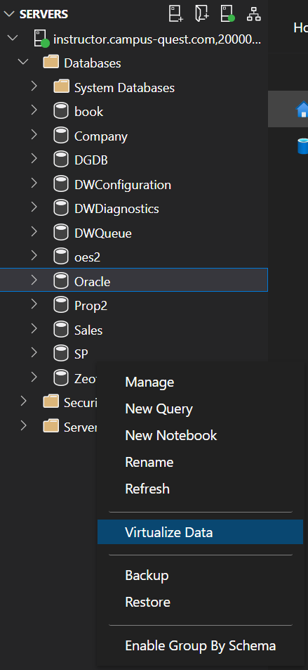
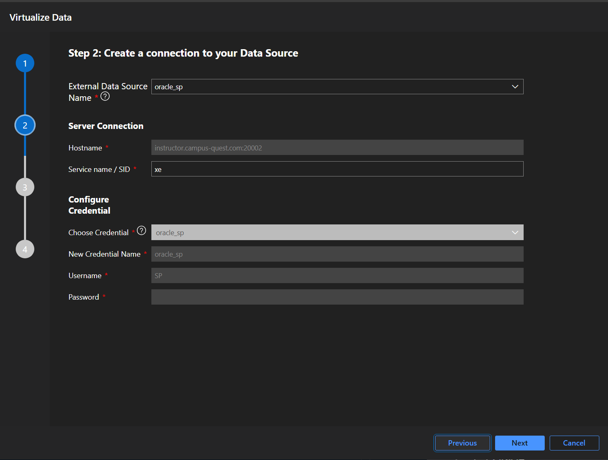
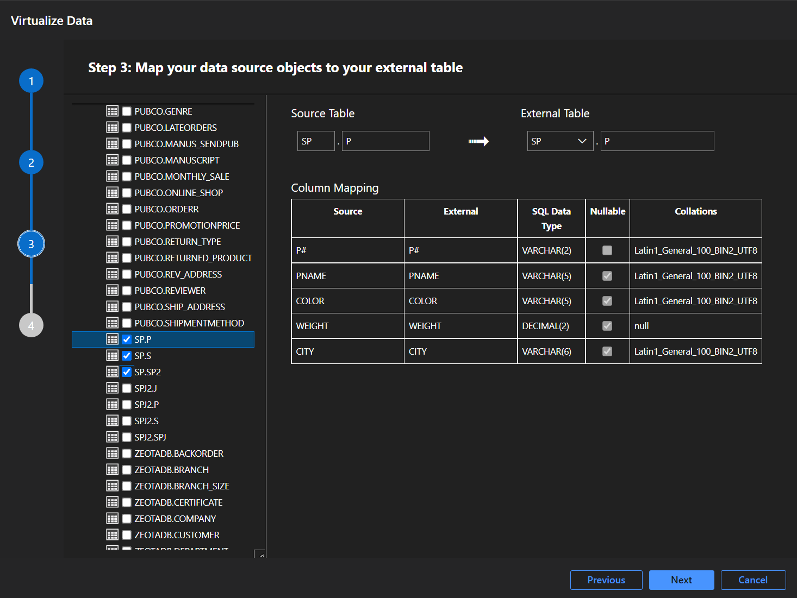
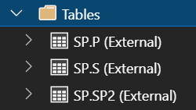
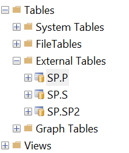
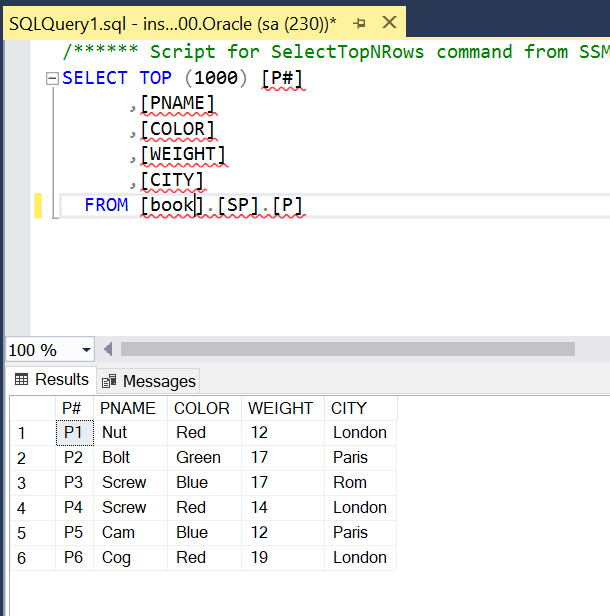

# Using Polybase to access Oracle Database from SQL Server

[Polybase](https://learn.microsoft.com/en-us/sql/relational-databases/polybase/polybase-guide?view=sql-server-ver16) is a feature that is similar to linked servers but is even more tightly integrated into SQL Server. With Polybase, you can directly access tables in Oracle, MongoDB, Hadoop, and even sources like generic S3 storage. These remote sources appear as normal "tables" in SQL Server, and you can query them as such - even including them in `JOIN`s!

The easiest way to generate the external tables is by using [Azure Data Studio](https://azure.microsoft.com/en-us/products/data-studio). The latest versions of SQL Server Management Studio (SSMS) install Azure Data Studio along with SSMS by default, so you may already have ADS on your system. However, if you find you need to isntall it, you can do so by [downloading it using this link](https://go.microsoft.com/fwlink/?linkid=2231303) and installing it.

**The steps for connecting to Oracle tables using Azure Data Studio are as follows:**

1. If you don't have it already, [downloading Azure Data Studio using this link](https://go.microsoft.com/fwlink/?linkid=2231303) and install it.
    - If this is your first time running Azure Data Studio, [prepare it for first use](#preparing-azure-data-studio-for-use) by checking for updates and installing the necessary *Data Virtualization* extension.
1. [Create a connection in Azure Data Studio](#connecting-to-sql-server-using-azure-data-studio) to your SQL Server instance.
1. [Create your database Master Key](#creating-a-database-master-key).
1. Create your [database scoped credential](#creating-a-database-scoped-credential) and your [external data source](#creating-the-oracle-database-connection) on the database by executing the given queries.
1. Finally, [use the Data Virtualization wizard](#creating-the-virtual-tables-using-the-virtualization-wizard) to auto-generate linked tables in SQL Server.
1. You're now ready to write queries that make use of the external Oracle tables - you can use them just as if they were local tables in your database!

## Preparing Azure Data Studio for use

After you install Azure Data Studio, it's a good idea to check for updates using the *Check For Updates* option under the *Help* menu in Azure Data Studio.

Another step you need to take is to install the **Data Virtualization Extensions**. This extension allows you to automate the generating of create scripts for the remote tables. (Otherwise, you need to manually write `CREATE EXTERNAL TABLE` scripts and exactly match the field names and compatible types yourself.) This is also part of why we are using Azure Data Studio - this functionality does not exist in SQL Server Management Studio at this time.

To install the extension, click the Extensions icon (). Once in the Extensions manager, type `data virtualization` into the search box. One result should appear - click the `Install` button to install the extension. You can then return to the home screen by clicking the Home icon ().

## Connecting to SQL Server using Azure Data Studio

To setup a connection to your SQL Server, you can either click the **Create A Connection** option in the Welcome window, or you can click the New Connection icon (). 

The New Connection window will appear. Fill in the fields as follows:

- **Connection Type**: Microsoft SQL Server.
- **Server**: The address of your server, including the port number separated by a comma. For example: `myserver.campus-quest.com,20200` (note: that's just an example - use *your* group's server!)
- **Authentication Type**: SQL Login.
- **User name**: `sa`. (You can use the sa account for this because we will be performing database maintenance tasks, which is an appropriate use for the `sa` account.)
- **Password**: The password for your `sa` account.
- **Database**: leave blank.
- **Trust server certificate**: True.
- Everything else can be left as-is.

Finally, click the Connect button to connect to the server. If all is successful you will see a summary screen for your server pop up!

You've now connected to SQL Server with Azure Data Studio! You will notice that some aspects of this application look familiar to SQL Server Management Studio. However, the *Data Virtualization* extension adds some critical functionality for our use case.

## Creating a database master key

In order to connect to external data sources, you need to create a master key on the database you will be working with on the SQL Server. The master key is used as part of the secure encrypted communication with remote servers. In particular, it encrypts the credentials you store for accessing a linked server.

Each database you intend to connect to a remote table needs a master key. You only need to create the master key once; in the future you **unlock** the master key using the password you set on the master key when you create it. **This password is important - losing it means you'll have to redo all of your linked table configuration.**

To create the database master key, right-click on the database you will work with and choose `New Query`. This will open an editor window that you can type a query into. You should make sure you are running queries against the correct database by checking the database shown in the drop-down list at the top of the query window.

The query to create a database master key is as follows. **Change `your password` with a unique password** - and make sure you make a note of the password!):

    CREATE MASTER KEY ENCRYPTION BY PASSWORD = 'your password'

> If you **already have a master key** on your database and it is locked, you can unlock it for use by running this query:
>
> `OPEN MASTER KEY DECRYPTION BY PASSWORD = 'your password'`

## Creating a database-scoped credential

A database-scoped credential is a login credential that is stored within a specific database. The credential is used to login to the remote server.

You can give each credential you create a name. This allows you to store multiple credentials in the database for different linked servers and tables. 

To add a credential, enter and execute this query. **Replace `credential_identifier` with a unique valid identifier** (you'll use it later) and **change `oracle_username` and `oracle_password` to match your server**:

    CREATE DATABASE SCOPED CREDENTIAL credential_identifier WITH 
        IDENTITY = 'oracle_username', 
        SECRET = 'oracle_password'

## Creating the Oracle database connection

Azure Data Studio's Virtualization wizard normally lets you specify the connection details within the wizard, but there is a bug that prevents this from working properly when connecting to Oracle 11g servers. So to help things along, we will manually create the Oracle database connection ourselves using a query.

The query is as follows. **Replace `data_source_name` with another unique identifier** that you'll use later, and **replace `oracle_host` and `oracle_port` with the correct values**. Finally, **replace `credential_identifier` with the same identifier you used** in the `CREATE DATABASE SCOPED CREDENTIAL` query.

    CREATE EXTERNAL DATA SOURCE data_source_name WITH ( 
        LOCATION = 'oracle://oracle_host:oracle_port',
        CREDENTIAL = credential_identifier
    )

Once you have run these two queries, you're ready to use the wizard to create linked tables!

## Creating the virtual tables using the Virtualization Wizard

Follow these steps to create your virtual tables:

1. Right-click the database you are working with in the Explorer view and choose `Data Virtualization`.

    

1. Select **Oracle** as the data source type in the first screen.

    

1. On the next screen, click on the `External Data Source Name` field and a pop-down should appear. You should be able to select the external data source you created above.

1. Enter `xe` in the SID field. Also note that you don't need to select the credential, since it was defined as part of the data source. You should then be able to click Next.

1. Open the `xe` item, then open the `Tables` item. It will take a few seconds to populate, and you should then see a list of all tables on the database server. (Note that you will also see tables for other users that you won't have access to - make sure you look for the tables beginning with your database name.) For example, in this screenshot we are selecting to add an external table for all three `SP` tables.

1. Finally, click Next, and then click Create (or alternatively click Generate Script if you want to see how the external tables are actually created.)

1. If all was successful, you should get a message indicating that the data virtualization wizard succeeded - congratulations! You can now check the tables in the database and you'll see the external tables listed as if they were local tables!

## Accessing the linked tables from SSMS

If you login to your SQL server with SSMS, you will now see the external tables listed under `External Tables`:

The linked tables work just like SQL Server tables. You can now run queries directly against the Oracle tables. The Oracle tables will be generated in a *namespace* in your SQL Server database which is the same name as the remote database in Oracle - so, for the `SP` database, the tables will appear in the `SP` namespace. You should include the namespace in your queries if you have similarly named tables in the default (`dbo`) namespace.

Below are the specifics for each step of the process:
