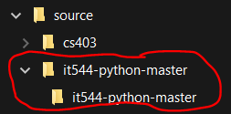
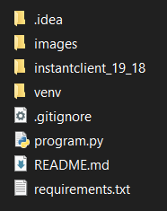
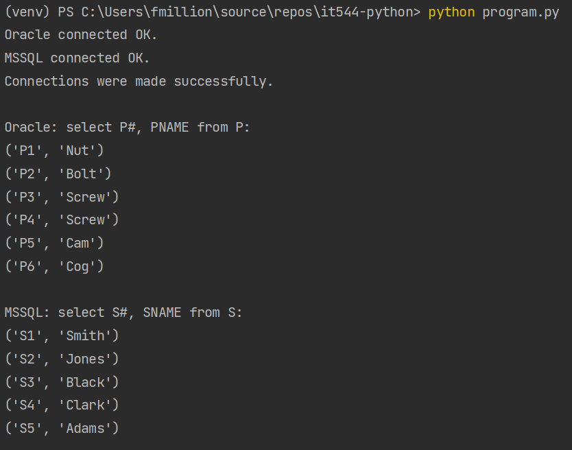

> If you're looking for documentation on **accessing Oracle from SQL Server**, see the [Polybase documentation](POLYBASE.md) in this repository.

# Accessing Oracle Database and Microsoft SQL Server from Python

This code will show you how you can access both Oracle Database and MS SQL from Python. It will demonstrate running a few queries as well as interacting with both databases simultaneously.

The basic version of the code in this repository works directly with the database servers and requires you to write queries, as you'll see in the code. An alternative option which is commonly used in modern programming environments is to use an object-relational mapper (ORM), which lets you represent the data tables as Python class instances (or whatever language you are working with). This is an advanced topic that we may explore later.

## Setting up the project

The main thing you need on your system is [Python](https://www.python.org/downloads/) (obviously!). Along with that, it's strongly recommended that you use an IDE such as PyCharm or VS Code to work with the code. 

The steps you will follow are as follows:

1. Make sure Python is set up on your system and the requirements for virtual environments are installed.
    - If you use Anaconda, you can [use it instead of `virtualenv`](#alternative-steps-for-anaconda-users). More information on this is included further on in the instructions.
2. [Download the code](#repository-download).
3. [Download Oracle Instant Client](#oracle-instant-client) and put it in the project folder.
4. [Open the project](#open-the-project-in-your-editor) in PyCharm (or your editor of choice).
5. [Edit the configuration variables](#explaining-the-code) to match the address, port, username, password, and so on for your group's servers.
6. [Run the code](#running-the-code) to make sure the database connection is working!

### Initial requirements setup

You also need to have `pip` installed, which is Python's built in package management toolset. On Windows, once you have Python installed, you should be able to run these commands at a command prompt to make sure `pip` is installed and updated to the latest version:

    python -m ensurepip
    python -m pip install -U pip

Finally, you need the `virtualenv` module, which lets you setup virtual environments. Alternatively, `anaconda` has a similar capability with the `conda` package manager. These instructions will use `virtualenv`, but if you're using `anaconda`, I can provide separate support for that. 

To install `virtualenv`:

    python -m pip install virtualenv

### Repository download

Download the repository by [**clicking this link**](https://github.com/fmillion-mnsu/it544-python/archive/refs/heads/master.zip).

The ZIP file contains one folder called `it544-python-master`. Extract this folder to somewhere on your system. When extracting, make sure you don't end up with a nested folder:

If you see this, copy the inner `it544-python-master` folder out of the nested folder.

### Oracle Instant Client

Since our servers are running Oracle 11g, you need to use **Oracle Instant Client** to connect to the servers. 

**Download Oracle Instant Client using these links:**

- [64-bit version](https://download.oracle.com/otn_software/nt/instantclient/1918000/instantclient-basiclite-windows.x64-19.18.0.0.0dbru.zip) - Try this version first - it's the one you most likely need.
- [32-bit version](https://download.oracle.com/otn_software/nt/instantclient/1918000/instantclient-basiclite-nt-19.18.0.0.0dbru.zip) - Use this if you get an error stating that there is no 32-bit client available.

Download the above link and open the ZIP file. You will see one folder named `instantclient_19_18` inside the ZIP file. **Extract this folder to the place where you extracted the source code.** Do not copy the files out of the folder - leave the folder intact!

If you have properly extracted the Oracle client, your `it544-python-master` folder should look similar to this (the `.idea` and `venv` folders is part of PyCharm and the virtual environment and you may not have it yet if you have not opened the project):

### Open the project in your editor

If you are using PyCharm, open the `it544-python-master` folder. (Note that depending on how you extracted the data, you may have a nested folder - e.g. `it544-python-master\it544-python-master`. You want to select the *inner* folder in this case.) If configured correctly PyCharm should offer to setup the environment for you. 

#### If PyCharm does not offer to setup the environment, or if you are using a different IDE

Open a **command prompt** and use the `cd` command to move to the path you extracted the files to.

Finally, **run these commands** to setup the virtual environment and download the required Python packages:

    python3 -m virtualenv venv
    venv\scripts\activate.bat
    pip install -r requirements.txt

> If you are on Linux, it's likely you already have a Python installed on your system. These instructions will be mostly the same, except you will use the command `source venv/bin/activate` instead of `venv\scripts\activate.bat`.

### Alternative steps for Anaconda users

If you use Anaconda, you can setup a `conda` environment instead of using `virtualenv`. 

Open the **Anaconda Powershell Prompt** from your Start menu and `cd` to the directory you have extracted the code to. Then, run these commands to setup your environment (note: you can replace `it544` with whatever environment name you wish; just make sure to use the same name whenever referencing the environment.)

    conda create it544
    conda activate it544
    conda install pip
    pip install -r requirements.txt

From here on, you can open the code in PyCharm or whatever editor you are using. Note that in some cases PyCharm may fail to detect the Conda environment, so you may need to keep the Anaconda prompt window open to manually run your code (i.e. `python program.py`).

## Explaining the code

The code is contained in `program.py`.

The first part of the code contains configuration values that **you must set prior to running the code.** If you don't set these values, the code won't run - that's on purpose!

After you have set up the variables, you should be able to run the code. The variables default to the SP database, but you can (and should) change them as required by your assignments and projects.

A few key points:

- For SQL Server, do not include the comma and port number in the `MSSQL_HOST` field. For example, if your server is `g1.campus-quest.com,21000`, then `MSSQL_HOST` should be simply `g1.campus-quest.com` and `MSSQL_PORT` should be `21000`.
- Leave the `ORACLE_SID` value as `xe` - no need to change it.
- To make sure the code works, leave the database as `SP`. The sample `select` queries reference the `SP` database.

You can see that it is quite straightforward to execute a `SELECT` query and iterate over the results. You can provide *any* `SELECT` query and iterate over it this way.

One more thing - make sure you read and comment out the line that raises a `SystemError`. This is to make sure you're paying attention!! :-D

### Note about SQL Injection

When you are forming SQL queries, make sure to be mindful of SQL injection attacks - these are extremely easy to allow if you are simply concatenating strings together to form SQL statements. Something like `"SELECT * FROM myTable WHERE id = " + id` can prove *catastrophic* - the user could simply make `id` equal to a string such as `0; DROP TABLE myTable; --`. The resulting query would look like this: `SELECT * FROM myTable WHERE id = 0; DROP TABLE myTable;`!! 

To avoid SQL injection vulnerabilities, the easiest way is to use *parameterized* queries. You do this by replacing parts of the query that you expect to receive input from some other source (such as a user, a file, etc.) with an identifier in the query string - such as `%s`, `?` or `:` depending on the DBMS. For SQL Server, you can use `%s`, and for Oracle you can use `:` followed by an identifier.

> **Example safe query in Oracle:**
>
>     cursor.execute("select * from myTable where id = :id",(0,))
>
> **Example safe query in SQL Server:**
>
>     cursor.execute("select * from myTable where id = %s",(0,))

## Running the code!

Once you've configured the settings, you should be able to run the code. If you are successful, you will see the output of two `SELECT` queries - one run against Oracle, and the other against SQL Server!

If you have configured everything successfully, you should see output like this:

## For More Information

- [Developing Python Applications for Oracle Database](https://www.oracle.com/database/technologies/appdev/python/quickstartpythononprem.html) at Oracle.
- The [Python oracledb](https://python-oracledb.readthedocs.io/en/latest/index.html) documentation.
- The [Python pymssql](http://www.pymssql.org/en/stable/index.html) documentation.

